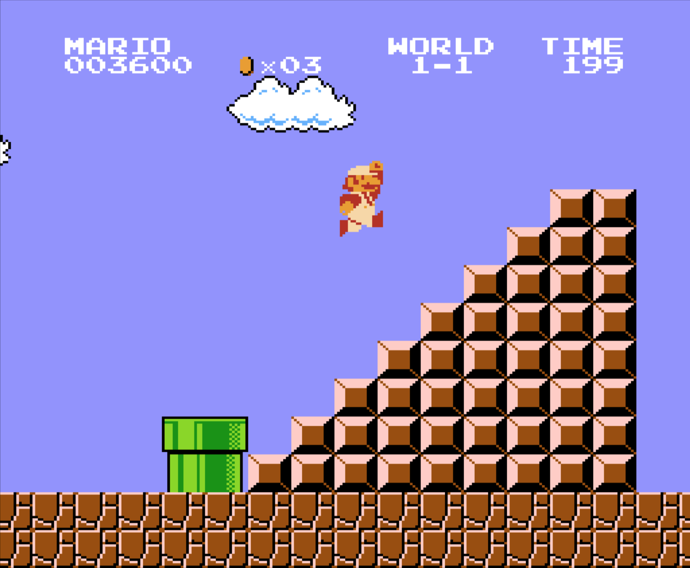

# Mario

## TL;DR

Create a program that prints the following shape with a user-inputted height:

```
~/workspace/ $ mario.py
height: 5
    ##
   ###
  ####
 #####
######
```

## Background

### Mario 1-1

In the 1985 game **Super Mario Bros.**, the first level ends with a half pyramid before Mario must jump onto a flag pole for bonus points! I decided to reminisce and play a little of the game myself and I took a screenshot!



We're going to create a program that prints out this same shape. However, we're going to make the program ask for user input for the height of the half-pyramid. Then, we're gonna print out the shape!

## Specification

- Write a program that recreates this half-pyramid using hashes (`#`) for blocks.
- To make things more interesting, first prompt the user for the half-pyramid's height, a non-negative integer no greater than `23`. (The height of the half-pyramid pictured above happens to be `8`.)
- If the user fails to provide a non-negative integer no greater than `23`, you should re-prompt for the same again.
- Then, generate (with the help of `print` and one or more loops) the desired half-pyramid.
- Take care to align the bottom-left corner of your half-pyramid with the left-hand edge of your terminal window.

## Help from CS50's own Zamyla Chan



## Check Your Work

To check your work run `check50 cs50/2017/ap/sentimental/mario/less`
