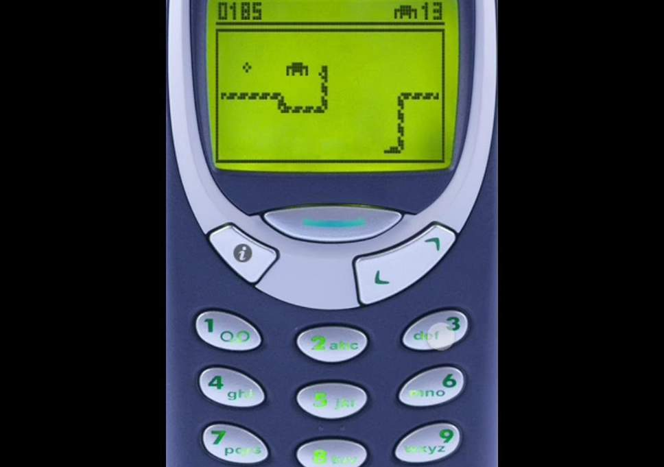
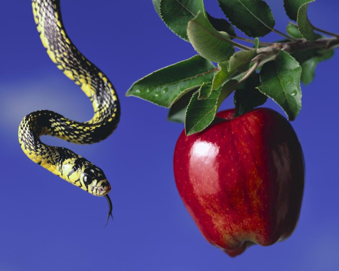

# Snake

## TL;DR

Implement the popular game called Snake!

## Background

If you're old enough to remember Snake, the hit game that everybody played on their Nokia phones in the early 2000s, you'll know how addictive it was to play!



Well, today we're going to use Python's Pygame module to recreate this game ourselves! The gist of it is that you are controlling this snake by moving it up, down, left or right so that it can collect (eat) apples and grow. The longer the snake, the higher your score. However, if the snake runs into itself, the game is over, so you need to be careful about how you move when the snake gets big!

### Learning goals

Before we jump into what we need to do, let's go over a few important notes about **class and instance variables** and **tuples**.

### Class and instance variables

Class variables contain data that should be true for all instances of the class, whereas instance variables are unique to each instance of the class. For example, taking a look a the Python [documentation](https://docs.python.org/3/tutorial/classes.html#class-and-instance-variables), let's consider the example of the `Dog()` class:

```
class Dog:

    kind = 'canine'         # class variable shared by all instances

    def __init__(self, name):
        self.name = name    # instance variable unique to each instance

>>> d = Dog('Fido')
>>> e = Dog('Buddy')
>>> d.kind                  # shared by all dogs
'canine'
>>> e.kind                  # shared by all dogs
'canine'
>>> d.name                  # unique to d
'Fido'
>>> e.name                  # unique to e
'Buddy'
```

We'll be using instance variables a lot in `snake.py` so make sure you take a reference this syntax! Specifically, whenever we are accessing, creating or modifying an instance variables within class methods, we always use the `self` keyword in order to access the instance variable. Later on in the specification, whenever we refer to instance variables, you'll need to remember that those are created and used within the class methods using the `self.variable` pattern.

### Tuples

Tuples in Python are simply an ordered sequence of elements. They are similar to lists, but unlike lists which can be changed (i.e. elements can be added and removed), tuples are *immutbale* meaning that they cannot be changed. Additionally, while lists are defined using square brackets, tuples are defined using parentheses and consist of elements separated by commas. A tuple can be defined like so:
```
my_tuple = (4, 11)
print(my_tuple[0]) # this prints 4
print(my_tuple[1]) # this prints 11
```
Since tuples are immutable, if you try to change the value of an element inside the tuple (i.e. `my_tuple[0] = 15`), you will get an error! 

Tuples can be useful when we have things like x- and y-coordinates, which always go in pairs. In this game, we'll use tuples which contain 2 elements, but keep in mind that tuples may contain more as well!

You can read up more on tuples [here](https://docs.python.org/3/tutorial/datastructures.html#tuples-and-sequences) and [here](https://www.programiz.com/python-programming/tuple) if curious!

### Tuples in `snake.py`

Open up `snake.py` and scroll down to lines 113 and 114. At that point, if you print out `self.positions` you'll see that self that positions is a list of tuples (though it may only contain one tuple if the snake's length is 1). In order to get the snake's current position defined by the position of the snake's head and save it in the `cur_position` variable, we access the first element of the `self.positions` list by zero indexing: `cur_position = self.positions[0]`. Thus, if you print out `cur_position`, that will now contain a tuple corresponding to the current position of the snake's head.

Next, on line 114, we see the following syntax: `x, y = self.direction`. If you print out `self.direction`, you'll see that it contains a tuple that indicate's the snake's current direction (it will be either `(0, -1)` for up or `(0, 1)` for down or `(-1, 0)` for left or `(1, 0)` for right and all of these directions are defined as constants in lines 21-24. On the left hand side of this line, we have `x, y`, and this syntax simply means that `x` will take on the value of the first element of the tuple and `y` will take on the value of the second element of the tuple. This is a more succinct way of accomplishing the following logic (though both are equiavlent):
```
x = self.direction[0]
y = self.direction[1]
```
After that we create the `new_position` variable, which is also a tuple containing the new position for the snake to advance towards. Based on the current position, the `GRIDSIZE`, which refers to the size of one square which makes up the snake and is also a constant defined in the beginning of the file, and the screen width and height we calculate the new position. You'll have to finish up the rest of this `move(self)` method to actually move the snake later on in your `TODOs`.


## Your Mission

Let's take a look at `snake.py`, since you're going to tackle a few `TODO`'s in there! Scroll down to line 92 where the class definition of `Snake`begins.

### 0. `def restart(self)`

The first class method you're going to write will be called whenever the game needs to be started or restarted. You'll want to do three things in this method:

1. Set the `length` instance variable of the snake. Whenever the game starts the snake begins and it is initially only one unit long, so you can use the syntax you see in the second line of the `def __init__(self):` method to set the `length` variable of the snake equal to 1.

2. Set the `positions` variable of the snake. Each square that the snake takes up will be defined by a position consisting of an X-coordinate and a Y-coordinate, which can both be saved in a **tuple**. To easily keep track of every square that the snake takes up, we'll save all of its square's positions in a list, which means we'll create a **list of tuples** (i.e. [(x~1~, y~1~), (x~2~, y~2~), (x~3~, y~3~)] would be what this list might look like for a snake of length 3, where x~1~ and y~1~ are the coordinates of the snake's head, x~2~ and y~2~ are the coordinates of its middle and x~3~ and y~3~ are the coordinates of its tail).

   So what should the values of the initial position of the snake be? Well, we conventionally want to start of the snake in the middle of the screen, so we just need to get the coordinates of the middle of the screen! How do we get those though? Scroll up in the file to lines 15-24, where we've defined some constants, and on line 17 you'll see the constants `SCREEN_WIDTH` and `SCREEN_HEIGHT`. You can use these constants to calculate the middle of the screen (halfway through the width and height) and put them in a tuple!

   Hint: Here you only need to set the initial position of the snake, so you need only one tuple to represent it, but in order to ensure that you can add to this list of positions, you'll want to put this tuple in a list!

3. Finally, set the `direction` variable that the snake should initially move in. We could hardcode this direction (i.e. set the snake to always go up or down), but it might be more fun to have our script pick a random direction each time the game starts. To make this choice, let's use Python's `random` module, which contains a number of potential functions you could select from.

   Hint: Take a look at the [following function](https://docs.python.org/2/library/random.html#random.choice), which takes in a list as an argument and returns a randomly selected element from that list. What elements should you put in the list? Well, if you scroll back up to lines 15-24, where we've defined some constants for you, you should see four directions defined. Try using those with this function!

### 1. `def get_head_position(self)`

The `get_head_position(self)` method should return the position of the front of the snake (i.e. its head). This means that you'll need to return a tuple that contains this value. Well, remember how in the previous method you implemented, `def restart(self)`, you set the position of the snake's head by creating a list containing a tuple? That tuple is in fact the pair of coordinates that gives us the position of the snake's head! Thus, here you just need to return the first tuple in the list from the `positions` variable of the snake.

### 2. `def point(self, point)`

For this method, you need to either simply point the snake in a new direction, or make sure that you preent any moves that are not allowed. The new direction that you want to move the snake in is contained in the `point` instnace variable, and to change the direction to equal `point`, you just need to set the `direction` variable equal to it.

However, you should be careful! When the snake length is 1, moving in the oppsite direction is allowed. So if the snake's length is only one square and it's going right, it is allowed to go left, and vice versa (and if it's going up, it's allowed to go down and vice versa). However, if the snake's `length` variable is greater than 1, then it shouldn't be allowed to move in the opposite direction, since it can't move onto itself. 

Thus, here you should check if both the snake's `length` variable is greater than 1 and if the direction contained in `point` is opposite of the snake's current direction (which can be accessed through the `direction` instance variable). If both of those conditions are true, you can simply put a `return`statement in that case. Otherwise, you can set the snake's `direction`instance  variable to equal the `point` instance variable that is passed in.

Hint: To get the current direction of the snake, you can access the `direction` variable and if you print out the `direction` variable, you'll see that it is a *tuple*. But how will you know that `point` contains a direction opposite of the current direction? Well, if you look back to lines 21-24, where all the directions are defined, you'll see that those directions are also *tuples*. To get the opposite direction of a given direction contaiend in a tuple, we simply need to get the values opposite of the ones contained in the tuple. For example, the opposite of the direction `(0, -1)` is `(0, 1)`, while the opposite of the direction `(1,0)` is the direction `(-1, 0)`. Hence, one way to get the opposite direction is to multiple each element of the tuple by `-1`. Then you'll want to see if the opposite direction is equal to the current direction, which is contained in the `direction` instance variable.

### 3. `def move(self)`

Remember our earlier description of the first part of `move()`? Make sure to refer back to it in case you need a refresher! 

To finish up this method, you'll want to actually move the snake! Let's consider a few edge cases first though. If the new position (square) that the snake tries to move into coincides with one of the squares in which its body is already located *and* if it's taking up more than 2 squares, that must mean that the snake has hit its body and that the game is lost, so it should be restarted. Thus, if `self.positions` contains more than 2 elements (which means that the snake is taking up more than 2 squares) *and* if the `new_position` variable that was calculated above is contained in `self.positions`, then you need to call the `restart()`method you wrote earlier to restart the game!

Otherwise, you need to update the position of the snake's head to equal the newly calculated `new_position`. In order to do this, you should insert `new_position` at the beginning of the `self.positions` list (i.e. it should be the first element). To do so, you might find the `list.insert(i, x)` method for lists useful, and you can read about its usage [here](https://docs.python.org/2/tutorial/datastructures.html).

Finally, as the snake moves forward to take up the new position, its tail should also move forward (i.e. it should not continue occupying the square it hadjust occupied). Otherwise the snake will take up more positions than it's  length, which wouldn't make sense! To ensure this doesn't happen, you should check if the length of the `self.positions` list is longer than `self.length` and if it is you should remove the final element from `self.positions`, since that last element is always the position of its tail. To remove the final element from the list, take a look at the `list.pop()` method for lists, which is described [here](https://docs.python.org/2/tutorial/datastructures.html).

### 4. `def randomize(self)`

In order to place an apple on the screen, we need to set its `position` instance variable, and since we want to place it in a different location each time the snake eats it, we'll want to randomize its position. Thus, you can set the apple's `position` variable to a *tuple*, the first element of which will be a random number between 0 and the width of the screen and the second element of which will be a random number between 0 and the height of the screen.

Hint: Take a look at the [documentation](https://docs.python.org/2/library/random.html#random.randint) for Python's `random` module again. You might find the `random.randint(a, b)` method useful, which returns a random integer `N` such that `a <= N <= b`. For the maximum values based on the screen's size and width, it might be useful to take a look at the constants again!

### 5. `def check_eat(snake, apple)`

The last thing you need to do for this problem set is to write the method that checks whether the snake has eaten an apple! How do we know that the snake has eaten the apple? Well if the snake reaches the apple and its head's position becomes equal to the position of the apple, then that must mean the snake went over the apple and ate it! Thus, check if the snake's head position is equal to `apple.position`. Good thing you wrote the `get_head_position()` method earlier so you can use it now! If this condition is true, then you can increase `snake.length` by 1 and then you should place the apple in a new random position. It's also awesome that you wrote the `randomize()` class method for apples earlier, so you can also simply call that method now!



## Checking Your Work

