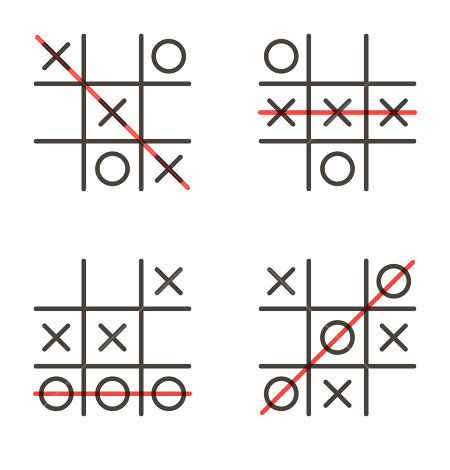

# Xs and Os

## TL;DR

Create a program that allows two people to play the game Tic-Tac-Toe.

## Background

### Tic-Tac-Toe

Welcome to the classic and simple game of [Tic-Tac-Toe](https://en.wikipedia.org/wiki/Tic-tac-toe), in which two players take turns strategically placing their chosen symbol (and X or an O) in a 3 x 3 grid. The game ends when one of the players manages to place their symbol in the three slots constituting a row, a column or diagonal, or when all the slots become filled up and no one wins, resulting in a stalemate.


If you're familiar with the game, you'll know that there are strategies you can follow that ensure you always win the game (or that at least you [never lose!](https://www.quora.com/Is-there-a-way-to-never-lose-at-Tic-Tac-Toe)). You'll get enough time to practice such strategies when you've finished implementing our incomplete version of Tic-Tac-Toe, for which we've provided you with some initial code, but we're hoping you can help up finish it up! We're going to do using Python to complete the game! First, we're going to familiarize ourselves with some data structures, including **lists** and **dictionaries**.

### Lists

In Python, we can create the **list** data structure, which quite literally stores a sequence of elements in order such as the one below:

```
grades = [91, 92, 87, 74, 95]
```

If we want to know what the first element in this list is (remember that in computer science we tend to use 0 to indicate the first element, 1 to indicate the second element, etc.), we can print it like so:

```python
# This will print 91
print(grades[0])
```

However, lists are useful when we want to store more than just simple values like numbers. In real-world, we often use more complex structures to represent information. For example, we might often need to somehow represent two-dimensional data, such as data you might store in a table or a martix. Turns out, Python allows you to store lists within a list, which in other programming contexts and languages may be referred to as 2D lists. If the above list consisted of a simple list of grades of one student in a single class, let's imagine we wanted to store all of the same student's grades, but he is taking 3 classes instead of one. How do we ensure that the grades for one class are distinct from the grades of another? We can use a list of lists, like so:

```
grades = [[91, 94, 89, 85, 89], [92, 92, 88, 89, 90], [90, 91, 86, 85, 90]]
```

The above can be formatted to look like this:

```
grades = [
		  [89, 94, 89, 85, 91], 
		  [86, 92, 88, 89, 90], 
		  [90, 91, 86, 85, 90],
		  [91, 93, 96, 89, 90]
		 ]
```

And you can see how the above 2D list might correspond to a table like the following:

| Class         |    |    |    |    |    |
|---------------|----|----|----|----|----|
| AP Chemistry  | 89 | 94 | 89 | 85 | 91 |
| AP Biology    | 86 | 92 | 88 | 89 | 84 |
| AP Psychology | 90 | 91 | 86 | 85 | 90 |
| AP English    | 91 | 93 | 96 | 89 | 92 |

The first element of `grades` here — `grades[0]` — is a list of numbers `[89, 94, 89, 85, 91]`. The first element of this new list is `grades[0][0] == 89` and 
`grades[0][1] == 94`
`grades[0][2] == 89`
`grades[1][0] == 86`
`grades[1][1] == 92`
`grades[1][4] == 84`

When working with a list of lists, we tend to use nested loops. The first loop iterates through the row number, the second loop runs through the elements inside of a row. For example, this is how we might print the contents of a 2D numerical list on the screen line by line, separating the numbers with spaces:

```python
a = [[1, 2, 3, 4], [5, 6], [7, 8, 9]]
for i in range(len(a)):
    for j in range(len(a[i])):
        print(a[i][j], end=' ')
    print()
```

The above snippet of code outputs:
```
1 2 3 4 
5 6 
7 8 9 
```

Now that we are a bit more familiar with 2D lists, we'll use them to represent a 3 x 3 tic-tac-toe board!

#### Lists in `helpers.py`

Open up `helpers.py` and on line 34, you'll see the below:

`board = [[] for _ in range(3)]`

In Python, this is known as a list comprehension, which is a very pythonic and concise way of creating lists. The other square brackets contain an expression follow by a for clause, which essentially resembles a shorthand for the for loop itself. The below list comprehension and for loop both achieve the same thing, creating the list `[0, 1, 2]`:

```python
new_list = [i for i in range(3)]

new_list = []
for i in range(3):
	new_list.append(i)
```

Finally, sometimes in Python we don't really care about putting real values in a list and we simply want to create a list containing a set number of values. If we wanted to create a list of three 1s using a list comprehension, we could do it like so: `new_list = [1 for _ in range(3)]`, which would create the list `[1, 1, 1]`.

Thus, going back to line 34, what do you think that line itself does? Place a print statement to check what the content of the variable `board`.

### Dictionaries

Dictionaries, or dicts for short, are a convenient data structure for whenever you desire a key-value relationship for your data. For example, think of what you probably know of as dictionary! There are entries for various words and related definitions. The word "pizza" may have the definition "a traditional Italian dish consisting of a yeasted flatbread typically topped with tomato sauce and cheese and baked in an oven." In this case "pizza" is the key, and the definition is the value.

In python we can create an empty new dictionary as such:

```
words = dict()
```

or

```
words = {}
```

Note that we have to use `{}` when reffering to dictionaries, just like with sets! However, unless you created a set using the `set()` function, python will actually interpret `{}` to mean a dict!

Let's say we want to add the word "happy" to our dict of words. We could do so by the following:

```
words["happy"] = "feeling or showing pleasure or contentment"
```

In this case "happy" is the key, accessed not unlike how we access a particular element in a list (exampleList[0], exampleList[1], ...). The definition "feeling or showing pleasure or contentment" is the value stored in that place. Thus, you can think of dictionaries as lists that are not limited to only having integer indices, but strings or data types as the key to access a particular value!

For more info on dictionaries, [visit Python's website](https://docs.python.org/3/tutorial/datastructures.html#dictionaries)!

#### Dictionaries in `helpers.py` and `tictactoe.py`

Going back to `helpers.py`, look at lines 43-51. In line 43 we have a for loop and in line 46 we have a second (nested) for loop. Immediately after this, on line 47, we access the `board` variable `board[row]`. Thinking back to what the `board` variable contains, in the previous 2D lists section, we found that board is itself a list of 3 lists, each of the lists responding to a row in the 3 x 3 Tic-Tac-Toe grid. Thus, when accessing `board[0]`, we access the first list within `board`, which corresponds to the first row of the Tic-Tac-Toe grid.

Thus, with the outer for loop, we access each of the rows, `board[0]`, `board[1]` and `board[2]`. Then, in the inner for loop, to each of the rows we append a **dictionary**, which represents some information about each of the cells in the grid:

```
{
    'played': False,
    'symbol': "", # Could be X or O, empty string by default
    'rect': pygame.Rect(left, top, rect_width, rect_height)
}
```

Here we can see that each cell in our tic-tac-toe board is defined by a dictionary with 3 key-value pairs: `played` shows us whether the current cell has been filled in with a symbol and starts out as False since all cells will be empty at the start of the game; `symbol` shows us the current symbol in each cell and starts out as `""`, which is the empty string since all cells are empty at the start of the game and finally, `rect` creates a rectangle in order to display the cell. We'll mostly concern ourselves with `symbol` and `played`.

Now, go to `tictactoe.py` and look at lines 30-37. In these lines, we initialize the game itself, and as you can see, the game is defined using a dictionary:

```
{
    'board': initialize_board(SCREEN_SIZE, starting_config),
    'current_player':  'X',
    'win': False,
    'stalemate': False,
    'change_player': False
}
```
This defines the initial values for the keys listed above when the game first starts. As you can see in lines 56 and 57, we can check the values for the keys in the `game` dictionary to see whether the game has been won (`if game['win']`), if a stalemate occurred (`if game['stalemate']`) or if one player has just made a move and thus, the current active player needs to change (`if game['change_payer']`).

## Your Mission

We're going to create a program that allows two people to play the game Tic-Tac-Toe ! Although the program is partially created, it looks like there's more work to be done!

You're going to tackle a few `TODO`'s in `tictactoe.py`.

### 0. `winner(board, symbol)`

In `tictactoe.py`, you'll see the function `def winner(board, symbol):`, which needs to check whether in the current board configuration (which you'll be able to access and check through the `board` variable) the last played symbol was a winning move (the last played symbol can be accessed through the `symbol` variable). In order to do this, you'll need to:

1. Check all rows to see if any one row has three identical symbols in it
2. Check all columns to see if any one row has three identical symbols in it
3. Check both diagonals to see if either of them has three identical symbols in it



If any row, column or diagonal contains three identical symbols, that means that the game was one, and you can return `True`. Otherwise, you should return `False`.

### 1. `is_stalemate(board)`

You need to create the function that checks whether in the current board configuration (which you can access through the `board` variable), there is a stalemate. This happens when all the cells in the 3 x 3 board are filled in a there is no row, column or diagonal that contains three identical consecutive symbols.

You should return `True` if there is a stalement, and `False` otherwise.

Hint: Remember that you can check whether a given cell has been played (i.e. already has a symbol in it), when accessing the `board` variable. If the top left element (the first element in the first row) is filled in, then `board[0][0]['played']` will return True.

If you can be clever about it, you could implement this function in one line! You might want to look into using Python's built-in `all()` function, which returns `True` when all elements are true in an iterable object. To read up on `all()`, visit this [tutorial](https://www.programiz.com/python-programming/methods/built-in/all) or the Python [documentation](https://docs.python.org/2/library/functions.html#all).

### 2. Use the functions you just wrote

Inside the `main()` function, we need to add a few more lines to make sure the functions we just wrote are being used properly! We need to update the values stored inside `game['win]` and `game['stalemate']` using the `winner(board, symbol)` and `is_stalemate(board)` functions we wrote in the previous steps. This involves calling the functions you wrote with the proper arguments and assigning them to the respective values in `game`.

Finally,  after line 67 (`render(screen, SCREEN_SIZE, game, clock)`), we need to do one last thing. That is, if the last move didn't win or end the game in a stalemate, we need to switch the current player of the game to the other one. Thus, if the following conditions are true:
1. The game has not been won.
2. A stalemate has not been reached.
3. A change of player is necessary.

You need to update the value of `current_player` in `game`. If the `current_player` was `X`, then `current_player` should be updated to `O` and vice versa.

## Checking Your Work

When ready to check your work, type `check50 TODO:MARIA/CREATE/CHECK` in the terminal and hit enter.
